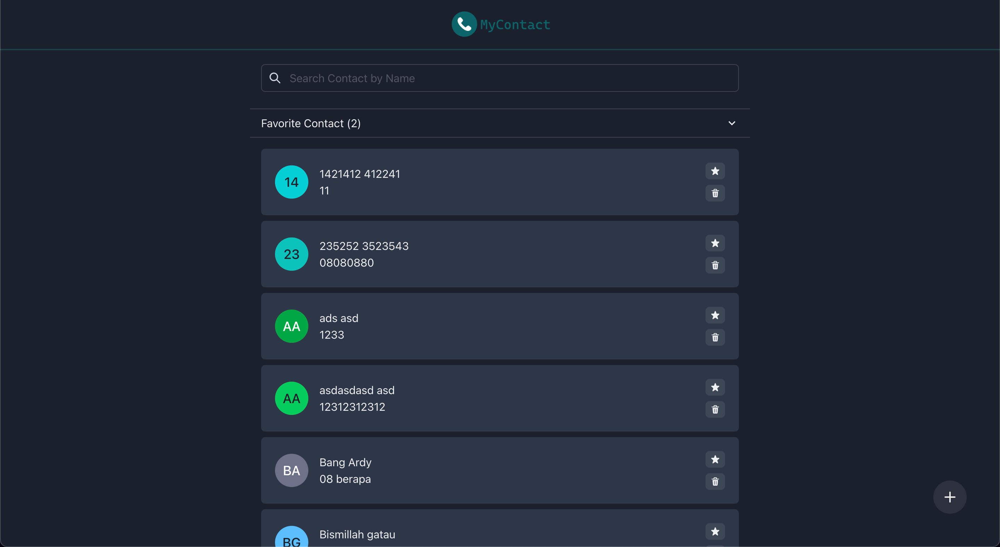
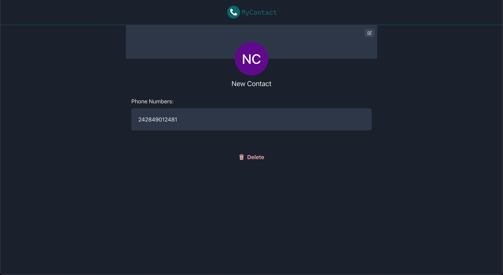
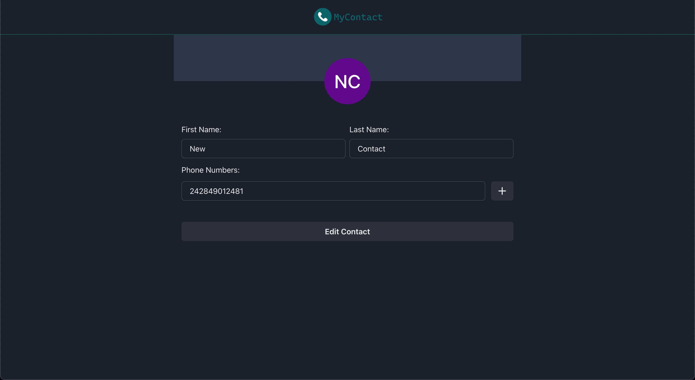
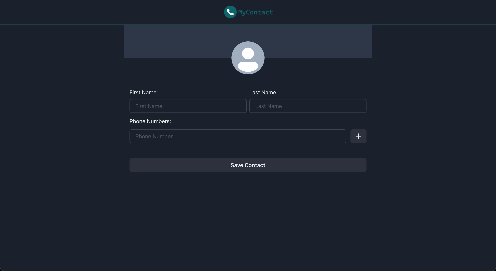

# MyContact

This app can show, add, edit and delete your contact, you also can add contact to favorite list. You can check the deployed app on [MyContact](https://my-contact-number.vercel.app/).

## Preview


  





## Build Setup
In the project directory, you can run:

``` bash
# Runs next dev which starts Next.js in development mode
npm run dev

# Runs next build which builds the application for production usage
npm run build

# Runs next start which starts a Next.js production server
npm run start

# Runs next lint which sets up Next.js' built-in ESLint configuration
npm run lint

# Run test case using jest
npm run test
```

## Technologies
This project uses several technologies listed below :

- **[NextJs](https://nextjs.org/docs)**, the React Framework for Production.
- **[Typescript](https://www.typescriptlang.org)**, a strict syntactical superset of JavaScript and adds optional static typing to the language.
- **[Apollo Client](https://www.apollographql.com/docs/react)**, is a comprehensive state management library for JavaScript.
- **[Chakra UI](https://chakra-ui.com/)**, is a simple, modular and accessible component library based on emotion.
- **[Jest](https://react-bootstrap.github.io/)**, is a JavaScript testing framework.
